## 1. Cost Management Dashboards
- #### Azure:
    - Monitoring costs
    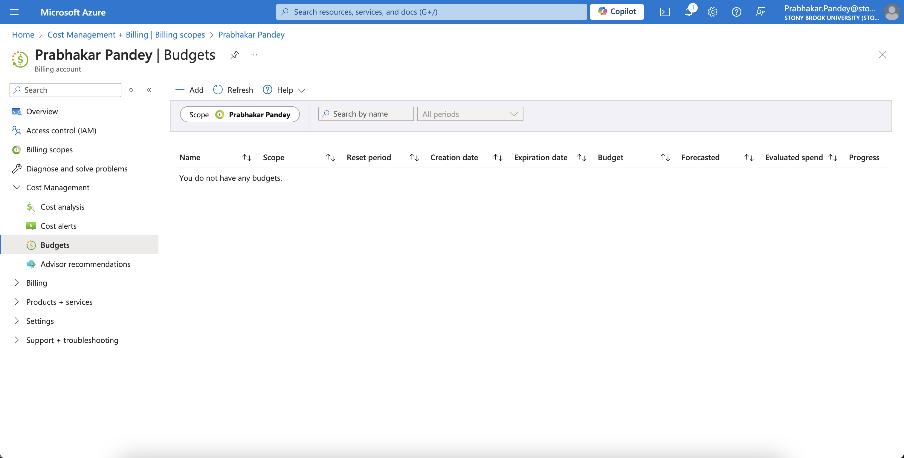

    - Setting budgets or alerts
    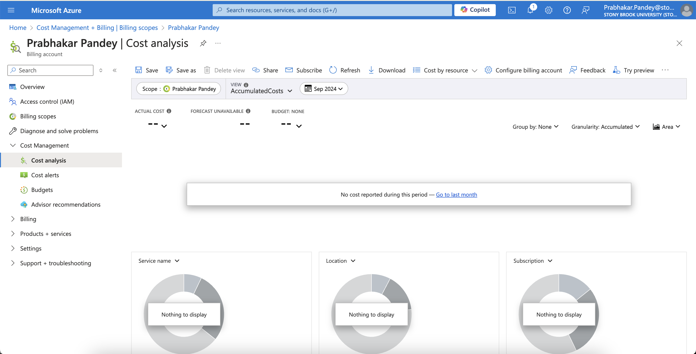

- #### GCP:
    - Billing Overview and Reports
    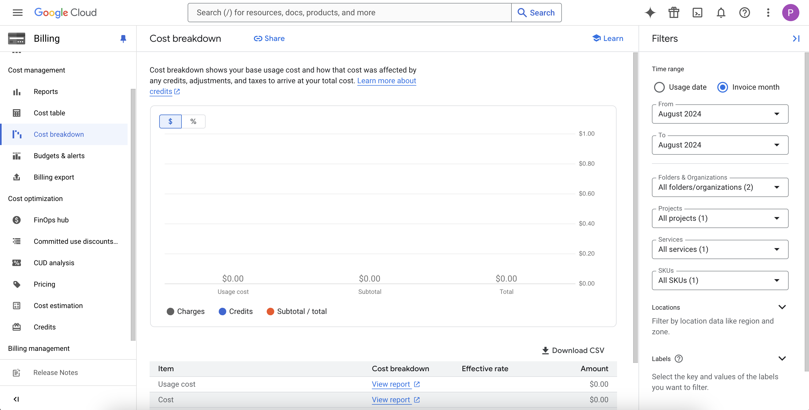
    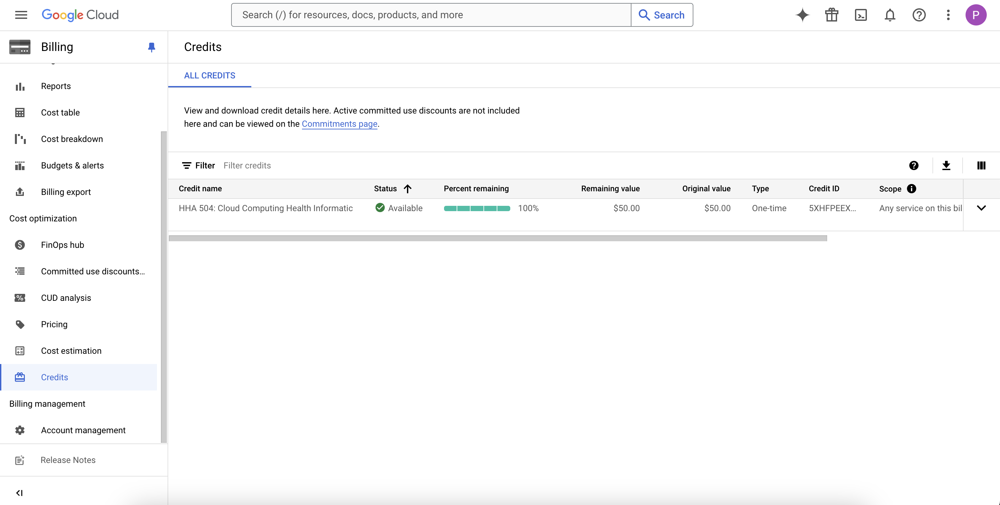

## 2. Hypothetical Budget

- #### Azure: 
    - Hypothetical monthly spend
    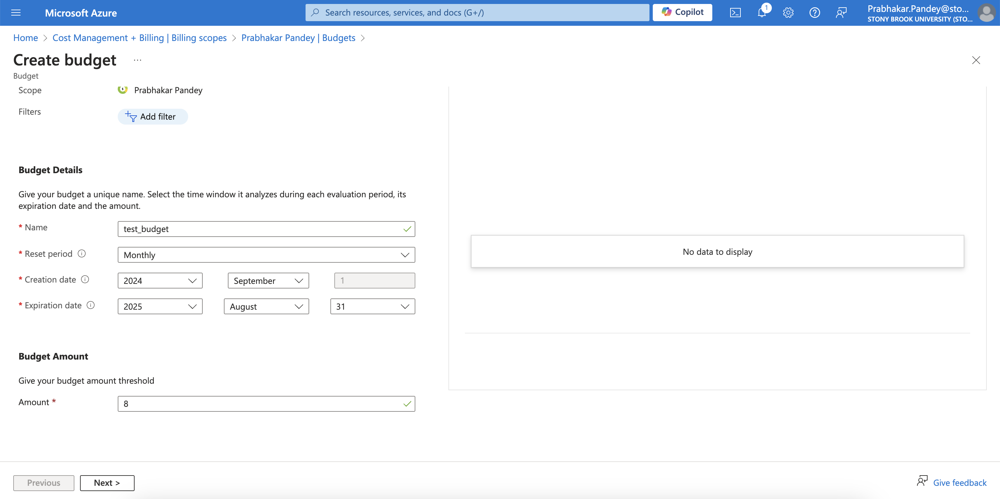
    - Budget alert
    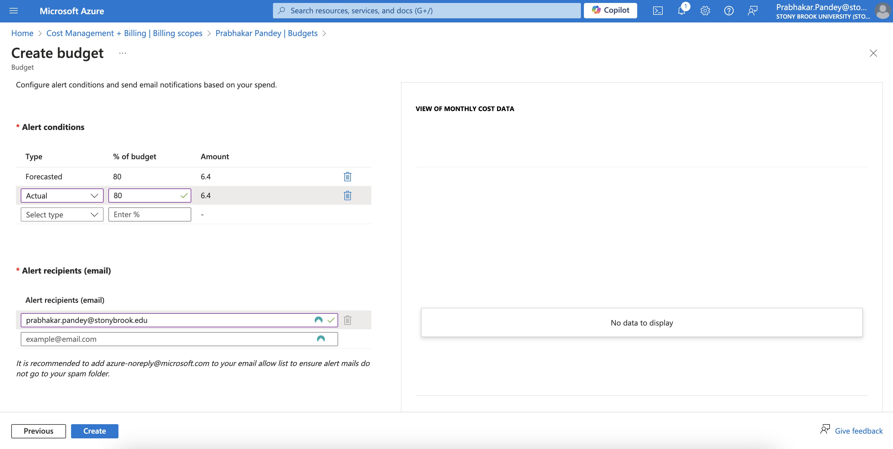

- #### GCP: 
    - Hypotherical budget and alert
    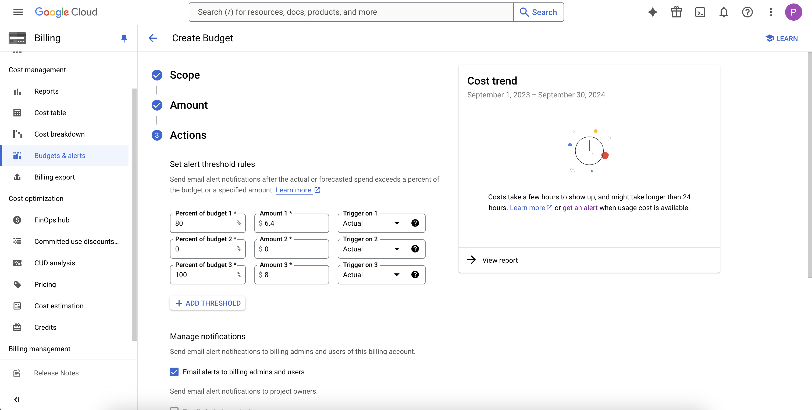

## 3. Cost Management Features

- #### Azure:
    - Advisor and cost analysis
    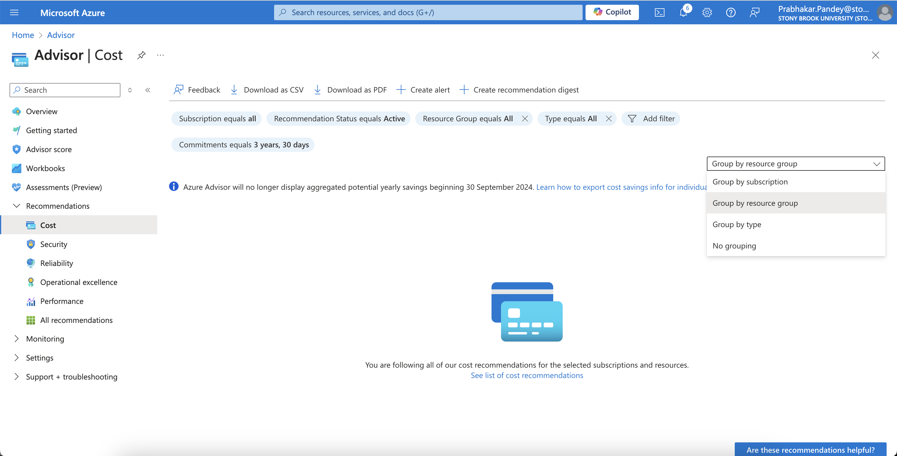
    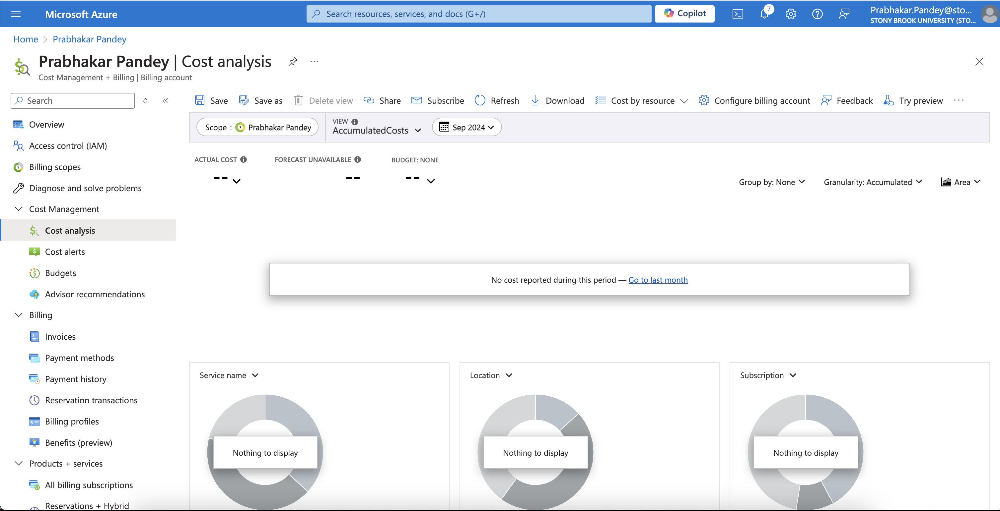

- #### GCP:
    - Cost estimates and Recommendations
    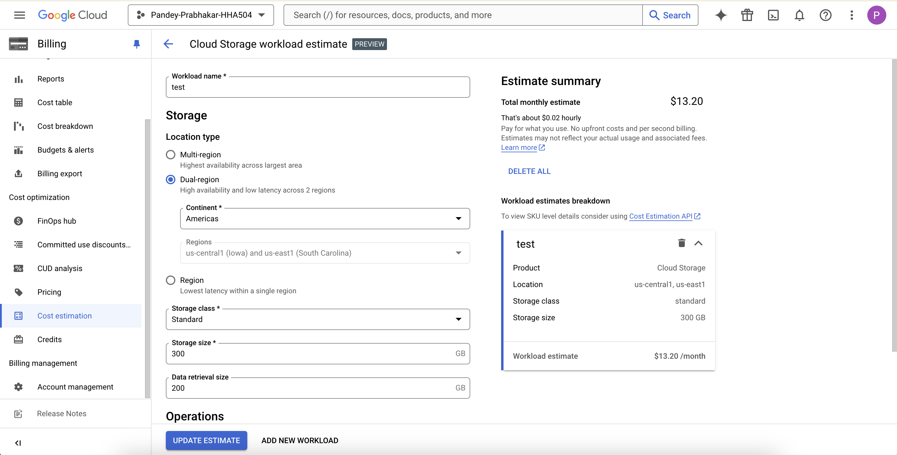
    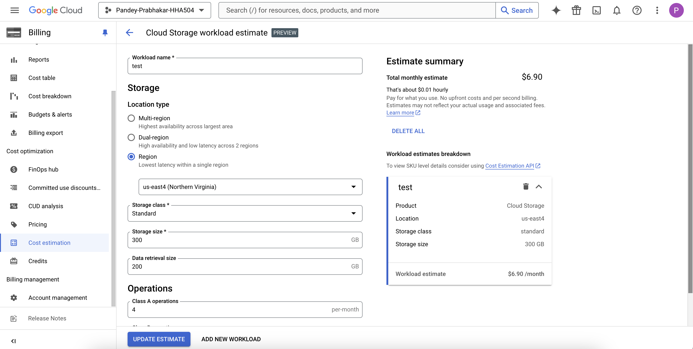
    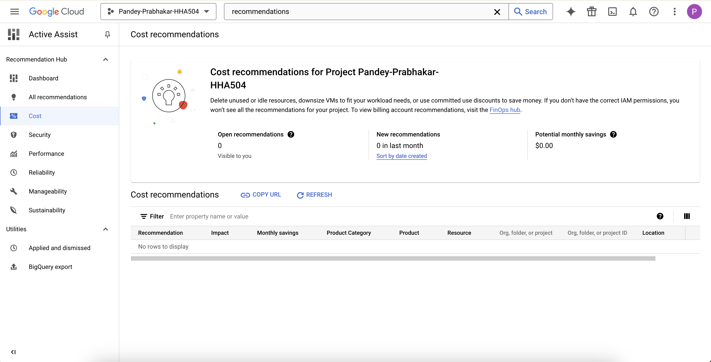

> Brief Description

Navigating the Cost Management and Billing dashboards on both Azure and GCP was fairly simple. The lack of services or data made it difficult to visualize data or utilize the filters. 

I was able to run a cost estimate on a hypothetical workload in GCP. I was able to see the price variations based on regions for Cloud Storage.

The Cost breakdown tab seems to be quite helpful once you have data. 